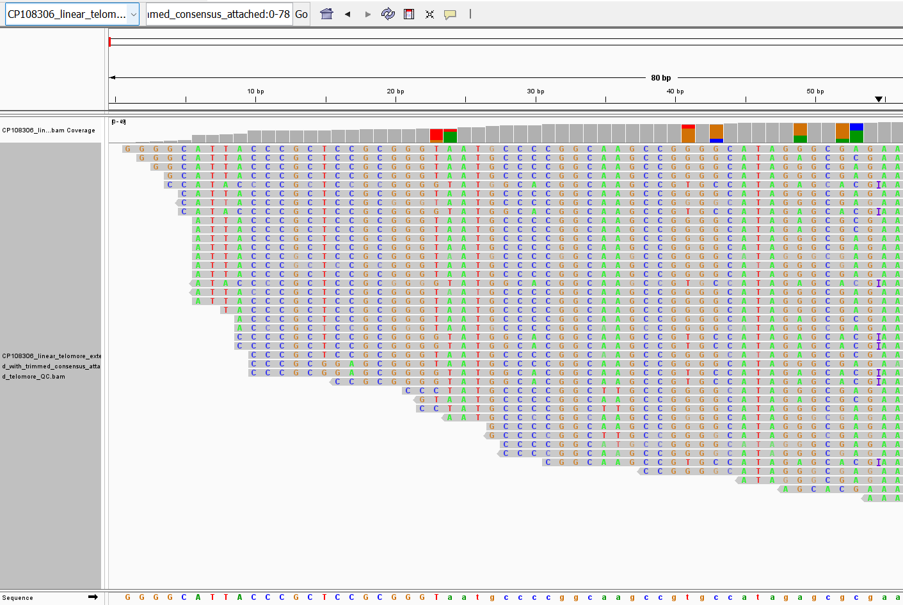
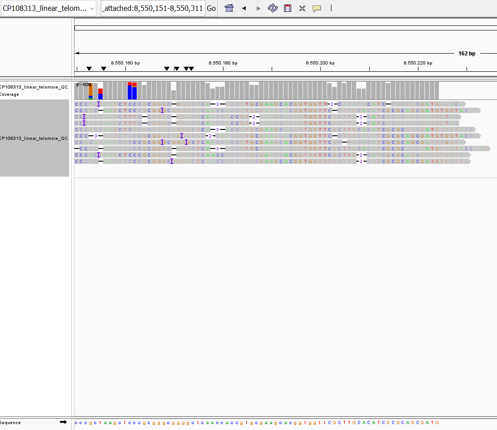
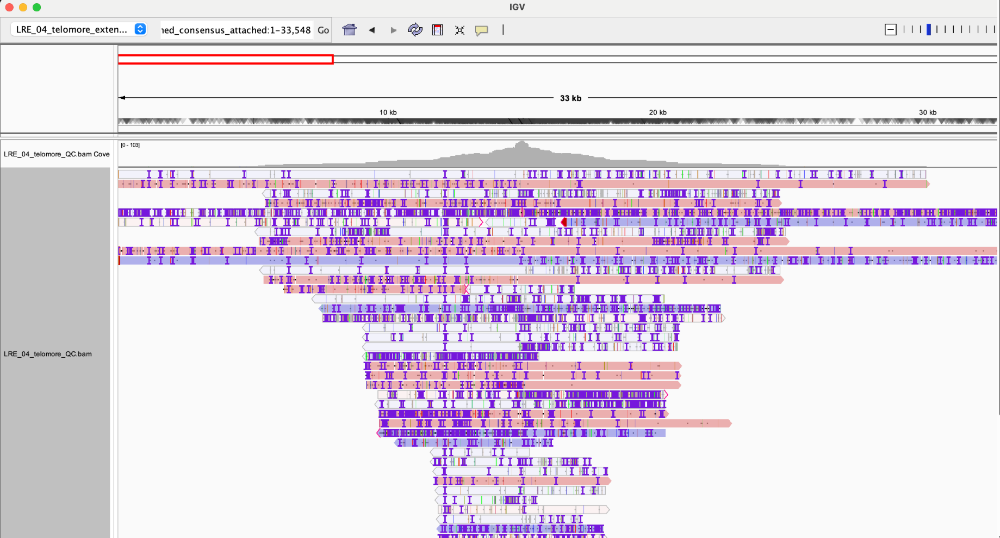

# TELOMORE
<p align="center">
  
</p>

Telomore is a tool for identifying and extracting telomeric sequences from
**Oxford Nanopore** or **Illumina** sequencing reads of *Streptomycetes spp.*
that have been excluded from a *de novo* assembly. It processes sequencing data
to extend assemblies, generate quality control (QC) maps, and produce finalized
assemblies with the telomere/recessed bases included.

## Table of Contents

- [Installation](#installation)
- [Before running Telomore](#before-running-telomore)
- [Usage](#usage)
- [Process Overview](#process-overview)
- [Outputs](#outputs)
- [Evaluating Output](#evaluate-output)
- [Citation](#citation)
- [License](#license)

## Installation

The easiest way to install telomore is using pip:
```bash
pip install telomore
```

Telomore depend on a number of CLI tools:
- Bowtie2
- Emboss tools (cons specifically)
- Lamassemble
- LAST-DB
- Mafft
- Minimap2, version 2.25 or higher
- Samtools

These can be installed using the conda recipe in this repo:

```bash
conda env create -f environment.yml -y
```

This repo can also be downloaded and used to install telomore:

```bash
# Activate telomore conda env
conda activate telomore

# Clone telomore repo
git clone https://github.com/dalofa/telomore && cd telomore

# Install package
pip install -e '.[dev]'
```

## Before running Telomore

Telomore does not identify linear contigs but rather rely on the user to provide
that information in the header of the fasta-reference file.

To capture the archetypal (or other actinobacterial) telomere in full in an otherwise
complete assembly, it is often sufficient to extend the assembly using Illumina data.
However, in certain cases large chunks of an arm is missing and thus, one must extend
with Nanopore before extending with Illumina data.

**Beware:** Telomore was designed with expectation of a complete/near-complete 
assembly, where each replicon is represented by a single contig. While, a more
fragmented assembly can be input, this might lead to the overrepresentation of
sequence.

## Usage

```bash
telomore --mode <mode> --reference <reference.fasta> [options]
```

Required Arguments

- `--mode` Specify the sequencing platform. Options: nanopore or illumina.
- `--reference` Path to the reference genome file in FASTA format.

Nanopore-Specific Arguments

- `--single` Path to a single gzipped FASTQ file containing Nanopore reads.

Illumina-Specific Arguments

- `--read1` Path to gzipped FASTQ file for Illumina read 1.
- `--read2` Path to gzipped FASTQ file for Illumina read 2.

Optional Arguments

- `--coverage_threshold` Set the threshold for coverage to stop trimming during
consensus trimming (Default is coverage=5 for ONT reads and coverage=1 for
Illumina reads).
- `--quality_threshold` Set the Q-score required to count a read position in the
coverage calculation during consensus trimming (Default is Q-score=10 for ONT
reads and Q-score=30 for Illumina reads).
- `--threads` Number of threads to use (default: 1).
- `--keep` Retain intermediate files (default: False).
- `--quiet` Suppress console logging.
 - `--skip_side` Skip processing of a terminal side. Accepts `left` or `right`.

Example (skip left side):
```bash
telomore --mode nanopore --single reads.fastq.gz --reference genome.fasta --skip_side left
```

## Process overview

The process is as follows:

1. **Map Reads:**
Reads are mapped against all contigs in a reference using either minimap2 or
Bowtie2.
2. **Extract Extending Reads**
Extending reads that are mapped to the ends of linear contigs are extracted.
3. **Build Consensus**
The terminal extending reads from each end is used to construct a consensus
using either lamassemble or mafft + EMBOSS cons
4. **Align and Attach consensus**
The consensus for each end is aligned to the reference and used to extend it.
5. **Trim Extended Replicon**
In a final step, all terminally mapped reads are mapped to the new extended
reference and used to trim away spurious sequence, based on read-support.

## Outputs

At the end of a run Telomore produces the following outputs:

```Output
├── {fasta_basename}_{seqtype}_telomore
│   ├── {contig_name}_telomore_extended.fasta
│   ├── {contig_name}_telomore_ext_{seqtype}.log
│   ├── {contig_name}_telomore_QC.bam
│   ├── {contig_name}_telomore_QC.bam.bai
│   ├── {contig_name}_telomore_untrimmed.fasta
│   └── {fasta_basename}_telomore.fasta
└── telomore.log # log containing run information.
```

In the folder there is a number of files generated for each contig considered:

| File Name | Description |
|-----------|-------------|
| `{contig_name}_telomore_extended.fasta` | Original contig sequence + added terminal bases - trimmed bases |
| `{contig_name}_telomore_ext_{seqtype}.log` | Log contianing information about bases added, trimmed off and final result. |
| `{contig_name}_telomore_QC.bam` | BAM file containing terminal reads mapped to `{contig_name}_telomore_extended.fasta`. Useful for manual inspection of the extension|
| `{contig_name}_telomore_QC.bam.bai` | Index file for the corresponding BAM file. |
| `{contig_name}_telomore_untrimmed.fasta` | Original contig sequence + added terminal bases |

Additionally, there is a fasta-file collecting all tagged linear contigs as they
appear in `{contig_name}_telomore_extended.fasta` together with all non-linear
contigs in the order they appear in the original file.

Inspecting the {contig_name}_QC.bam-file in IGV (Integrative Genomics Viewer)
can be informative in evaluating the extended contig.

## Evaluate Output
The best way to evaluate whether your assembly have been extending in a meaningful way is to inspect the QC-bam file produced at the end of the Telomore workflow. Ideally you would a high degree of correspondance between the consensus and the reads used to build it.

### Example 1: Illumina extension of NBC_00015
The chromsome of Streptomyces sp. NBC_00015 were extended with ONT data and subsequently with Illumina data. The Illumina data extended the left end with 23 bases, which look weel supported when inspecting the bam file at the end.
<p align="center">
  
</p>

### Example 2: Nanopore extension of NBC_00008
The chromsome of Streptomyces sp. NBC_00008 were extended with ONT data. The right end were extended with 23 bases, which seem well supported by the aligned reads. However, about 7 bases were trimmed of the consesus due to low quality of the final bases of the reads. Thus, one could consider other sequencing methods or rerunning with a decreased threshold for trimming.
<p align="center">
  
</p>
### Example 3:

### Example 4: Hairpin-type telomeres (closed telomeres)
Certain bacteria (Such as Borrelia) utilize a type of telomere with covalently closed hairpins, rather than a blunt-end with a protein. These telomeres have the opposite problem, where a chimera is formed by readthrough of the hairpin onto the complementary strand. Using such reads will overextend the genome with complementary strand since the reads themselves support it:
<p align="center">
  
</p>
See #51 for an example (which also where this example originates from). [Autocycler](https://github.com/rrwick/Autocycler/wiki/Linear-sequences) provides options for dealing with this issue.
For mixed cases, where a hairpin-type telomere is on one end and streptomyces type telomere is on the end skip-side can be used to control which side are extended.
